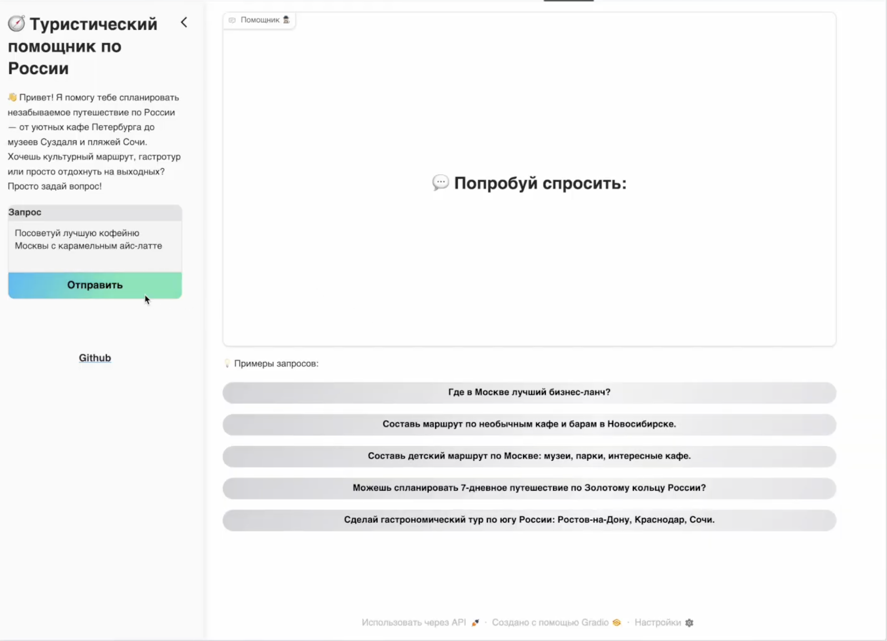

# **Travel Agent 🕵🏾**

A smart travel planning assistant that leverages Retrieval-Augmented Generation (RAG) to provide personalized travel recommendations and insights.

## 📚 **Documentation**

Visit [GitHub Pages](https://miem-refugees.github.io/travel-agent) for documentation and API references.

## 🎯 **Features**

- Personalized trip planning assistance
- Efficient information retrieval using reviews vector search
- Natural language interaction for travel queries

## 🛠️ **Tech Stack**

- **Python** 3.13
- **[DVC](https://dvc.org)** - Data Version Control
- **[Qdrant](https://qdrant.tech)** – Vector database for efficient dense retrieval
- **SmolAgents** – Compact agent framework for orchestrating RAG flows

## 📊 **Dataset**

This project utilizes the [Yandex Geo Reviews 2023](https://github.com/yandex/geo-reviews-dataset-2023) dataset for providing location-based insights and recommendations.

## 🚀 Demo video

